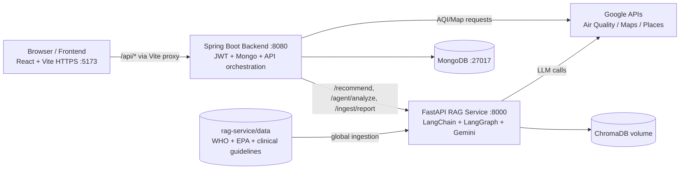

# BreatheSmart

BreatheSmart is a full-stack air-quality and health-intelligence platform.
It pairs live AQI with retrieval-grounded health guidance and an agentic
analysis flow — every recommendation cites the documents it was built on.

Highlights:

- Real-time AQI, 24-hour history, and forecast on an interactive map
- JWT-authenticated user profile, saved locations, medical-report uploads
- **RAG-grounded** personalized recommendations with source snippets
- **LangGraph agent** that picks its own tools (live AQI + RAG)
- **RAGAS evaluation** with the same Gemini + HF embeddings used in production
- **Structured JSON logging** for every RAG event (query, sources, latencies)
- **Docker Compose** stack: Mongo + RAG service + Spring backend in one command
- Graceful degradation: deterministic fallback recommendations and a templated
  daily summary if Gemini is unreachable

This repository is a monorepo with three runtime services:

- `frontend` — React 19 + Vite (HTTPS dev server)
- `backend` — Spring Boot 3.5 + MongoDB + JWT + Spring AI
- `rag-service` — FastAPI + LangChain + LangGraph + Gemini + ChromaDB

---

## Table of contents

1. [System architecture](#system-architecture)
2. [How data flows](#how-data-flows)
3. [Tech stack](#tech-stack)
4. [Prerequisites](#prerequisites)
5. [Quick start with Docker Compose (recommended)](#quick-start-with-docker-compose-recommended)
6. [Manual local setup](#manual-local-setup)
7. [Environment variables and secrets](#environment-variables-and-secrets)
8. [Populating the RAG data folder](#populating-the-rag-data-folder)
9. [AI evaluation with RAGAS](#ai-evaluation-with-ragas)
10. [Observability and structured logging](#observability-and-structured-logging)
11. [Google APIs and required setup](#google-apis-and-required-setup)
12. [HTTPS certificates and geolocation requirements](#https-certificates-and-geolocation-requirements)
13. [API reference](#api-reference)
14. [RAG service internals](#rag-service-internals)
15. [Security model](#security-model)
16. [Troubleshooting](#troubleshooting)
17. [Project structure](#project-structure)

---

## System architecture



### Service responsibilities

#### Frontend
- Map visualization, auth modals, profile modal, charts, report upload UX.
- `/api` proxied to backend by Vite.
- HTTPS in dev (`vite.config.js` uses `@vitejs/plugin-basic-ssl`) so the
  Geolocation API works.

#### Backend
- Owns auth, user profile, saved locations, report metadata.
- Orchestrates Google Air Quality API calls.
- Proxies the RAG service for recommendations, agent runs, report ingestion.
- Spring AI ChatClient produces a non-RAG daily digest with a deterministic
  fallback if Gemini is down.
- All RAG-side errors are mapped to honest HTTP codes (502 / 503 / 504).

#### RAG service
- Ingests global health-guideline documents into ChromaDB.
- Ingests user-specific report text into a per-user vector namespace.
- Retrieves dual-scope context (global + user) and produces structured
  `{primary, secondary}` JSON recommendations with source snippets.
- LangGraph agent with a system-prompt tool-use policy, recursion limit,
  and explicit fallback if the LLM call fails.
- Emits one structured JSON event per recommendation for observability.

---

## How data flows

### 1) AQI dashboard
1. Frontend → backend `/api/air-quality/{current|history|forecast}`.
2. Backend → Google Air Quality API.
3. Backend returns a normalized payload.
4. Frontend renders gauge, pollutants, and charts.

### 2) RAG recommendation
1. User clicks "Personalised recommendations".
2. Frontend → backend `/api/ai/recommendations` with the current AQI payload.
3. Backend builds the profile + AQI envelope, calls RAG `/recommend`.
4. RAG retrieves from `scope=global` + `scope=user_<userId>` (if reports uploaded).
5. Gemini returns structured JSON; pipeline coerces it to `{primary, secondary}`.
6. Frontend renders the recommendation, source snippets, and a "fallback" badge
   if grounding was poor or the LLM degraded.

### 3) Agentic analysis
1. Frontend → backend `/api/ai/agent` with `{city, age, medical_conditions, question}`.
2. Backend forwards to RAG `/agent/analyze`.
3. LangGraph agent autonomously calls `fetch_aqi_for_city`, then
   `get_health_recommendation`, then summarizes — its tool ordering is enforced
   by the system prompt, not the user message.
4. Frontend renders the answer + a friendly tool trace.

### 4) Report upload
1. Frontend uploads multipart file to backend `/api/users/{userId}/reports`.
2. Backend stores the file, extracts text via Apache Tika.
3. Backend → RAG `/ingest/report` (with size cap + medical-relevance gate).
4. RAG validates the text is medical, then chunks and indexes it.
5. Backend appends a `Report` to the user document.

---

## Tech stack

### Frontend
- React 19, Vite 7
- Material UI + icons
- Chart.js + react-chartjs-2
- Axios with auth interceptor

### Backend
- Java 21, Spring Boot 3.5.6
- Spring Security + JWT (jjwt 0.12)
- Spring Data MongoDB (servlet stack pinned)
- Spring AI (Gemini via OpenAI-compatible endpoint)
- WebFlux WebClient (for the RAG service)
- Apache Tika 2.9 (multi-format text extraction)
- SLF4J logging throughout

### RAG service
- FastAPI + Uvicorn
- LangChain + LangGraph
- `langchain-google-genai` (Gemini)
- ChromaDB (`langchain-chroma`)
- HuggingFace embeddings (`all-MiniLM-L6-v2`, CPU)
- RAGAS for offline RAG evaluation
- Structured JSON logging (custom formatter)

---

## Prerequisites

Pick one of the two paths below.

**For Docker Compose (recommended)** — all you need:
- Docker 24+ with Compose v2
- Google AI Studio API key for Gemini
- (Optional) Google Maps / Places / Air Quality API key

**For manual local setup:**
- Node.js 20+ and npm
- Java 21
- Maven 3.9+ (or use the bundled `./mvnw`)
- Python 3.11+ (3.12 recommended)
- MongoDB on `mongodb://localhost:27017`
- Same Google keys as above

---

## Quick start with Docker Compose (recommended)

The compose stack runs Mongo, the RAG service, and the Spring backend on a
shared private network. ChromaDB and Mongo data persist via named volumes.
The frontend is **not** containerized — run it locally with Vite so HTTPS
+ hot reload work properly.

### 1) Configure secrets

```bash
cp .env.example .env
```

Edit `.env` and fill at least:

```env
GEMINI_API_KEY=...your Google AI Studio key...
JWT_SECRET=...generate with: openssl rand -hex 64...
GOOGLE_MAPS_API_KEY=...optional but enables live AQI in the agent...
```

> The default `MONGODB_URI` points at the in-network Mongo container.
> If you want to use Atlas instead, override `MONGODB_URI` here.

### 2) Bring the stack up

```bash
docker compose up --build
```

You should see three healthy services:

- `breathe-mongo` on `localhost:27017`
- `breathe-rag` on `http://localhost:8000` — JSON logs in stdout
- `breathe-backend` on `http://localhost:8080`

Smoke-test:

```bash
curl http://localhost:8000/health
curl http://localhost:8080/actuator/health
```

### 3) Populate the global RAG corpus (first run only)

Once the rag-service is up, ingest the bundled markdown guidelines:

```bash
curl -X POST http://localhost:8000/ingest/global
```

If you want a richer corpus, see [Populating the RAG data folder](#populating-the-rag-data-folder).

### 4) Run the frontend locally

In a separate shell:

```bash
cd frontend
npm install
echo "VITE_GOOGLE_MAPS_API_KEY=...your key..." > .env.local
npm run dev
```

Open `https://localhost:5173`. Sign up, log in, and the rest of the app talks
to the containerized backend automatically.

---

## Manual local setup

If you prefer to run the services without Docker.

### 1) Start MongoDB
On `mongodb://localhost:27017`.

### 2) RAG service

```bash
cd rag-service
python -m venv venv
# Windows:
venv\Scripts\activate
# macOS/Linux:
# source venv/bin/activate

pip install -r requirements.txt
cp .env.example .env       # copy .env.example .env  on Windows
```

Set `GEMINI_API_KEY` (and optionally `GEMINI_MODEL`) in `rag-service/.env`.

```bash
python main.py
# RAG service: http://localhost:8000
```

### 3) Backend

```bash
cd backend
```

Set the required env vars (PowerShell shown — use `export NAME=value` on
macOS/Linux):

```powershell
$env:GOOGLE_MAPS_API_KEY="..."
$env:GEMINI_API_KEY="..."
$env:JWT_SECRET="..."   # at least 32 bytes of randomness
```

Optional overrides:

```powershell
$env:RAG_SERVICE_BASE_URL="http://localhost:8000"
$env:SPRING_DATA_MONGODB_URI="mongodb://localhost:27017/breathesmart"
$env:APP_UPLOADS_DIR="./uploads/reports"
```

Run:

```bash
./mvnw spring-boot:run
# Backend: http://localhost:8080
```

### 4) Frontend

```bash
cd frontend
npm install
echo "VITE_GOOGLE_MAPS_API_KEY=..." > .env.local
npm run dev
# Frontend: https://localhost:5173
```

---

## Environment variables and secrets

Never commit secrets. The repo gitignores `.env`, `.env.*`, but **whitelists
`.env.example`** so the template stays in version control.

### Root `.env` (Docker Compose only)

| Variable | Required | Notes |
| --- | --- | --- |
| `GEMINI_API_KEY` | yes | Single key used by both rag-service and Spring AI. |
| `JWT_SECRET` | yes | ≥64 random hex chars. `openssl rand -hex 64`. |
| `GOOGLE_MAPS_API_KEY` | optional | Enables live AQI in the agent. |
| `MONGODB_URI` | optional | Defaults to in-network Mongo container. |
| `GEMINI_MODEL` | optional | Defaults to `gemini-2.5-pro`. |

### `rag-service/.env`

| Variable | Default | Notes |
| --- | --- | --- |
| `GEMINI_API_KEY` | — | Required. |
| `GEMINI_MODEL` | `gemini-2.5-pro` | |
| `CHROMA_DB_PATH` | `./chroma_db` | Mounted to a Docker volume in compose. |
| `CHROMA_COLLECTION_NAME` | `breathesmart_global` | |
| `EMBEDDING_MODEL` | `sentence-transformers/all-MiniLM-L6-v2` | Pre-baked into the Docker image. |
| `LOG_FORMAT` | `json` | Set to `text` for human-readable dev logs. |
| `LOG_LEVEL` | `INFO` | |
| `SIMILARITY_THRESHOLD` | `1.2` | Tune after RAGAS runs. |
| `RETRIEVER_K` | `4` | |
| `LLM_TIMEOUT_S` | `30` | Per-call Gemini timeout. |
| `LLM_MAX_RETRIES` | `2` | |
| `AGENT_RECURSION_LIMIT` | `8` | LangGraph hard cap. |
| `CORS_ALLOWED_ORIGINS` | local origins | Comma-separated. |

### `frontend/.env.local`

| Variable | Notes |
| --- | --- |
| `VITE_GOOGLE_MAPS_API_KEY` | Browser-side key. Restrict by HTTP referrer (see Google APIs section). |

### Backend (read by `application.properties`)

All have placeholder defaults but are intended to be overridden in
production:

- `GOOGLE_MAPS_API_KEY`, `GEMINI_API_KEY`, `JWT_SECRET`
- `SPRING_DATA_MONGODB_URI`, `RAG_SERVICE_BASE_URL`
- `APP_UPLOADS_DIR`

---

## Populating the RAG data folder

The retrieval quality of `/recommend` depends entirely on what's in
`rag-service/data/`. Anything in there gets chunked, embedded, and stored
under the `global` scope when you POST to `/ingest/global`.

### What's already included

The repo ships a small but useful seed corpus of curated markdown:

```
rag-service/data/
├── asthma_air_quality.md
├── cardiovascular_air_quality.md
├── children_air_quality.md
├── elderly_air_quality.md
├── epa_aqi_categories.md
├── who_air_quality_guidelines.md
└── pdfs/                  # gitignored — drop manual PDFs here
```

The bundled `.md` files are good enough for a demo. For a stronger evaluation
score and more interesting source citations, add real PDFs from authoritative
sources.

### Supported file types

The loader (`app/ingestion/loader.py`) understands:

| Extension | Loader |
| --- | --- |
| `.pdf` | `PyPDFLoader` (extracts page text) |
| `.txt` / `.md` | UTF-8 text |
| `.html` / `.htm` | BeautifulSoup → cleaned text |

Anything else is skipped silently.

### Option A — automatic download (preferred for HTML)

```bash
cd rag-service
python scripts/download_docs.py
```

This pulls a handful of WHO / EPA / AHA / Lung Association pages and saves
them under `data/`. Stale URLs print a `FAILED` line — find the new URL and
update `DOCS` in [`scripts/download_docs.py`](rag-service/scripts/download_docs.py).

### Option B — manual PDFs (recommended)

Some agencies use JS redirects or interactive download flows that defeat the
script. Drop those into `rag-service/data/pdfs/` and they'll be picked up by
the loader. Sources we recommend for the BreatheSmart corpus:

| Source | What to grab | Why |
| --- | --- | --- |
| WHO Global Air Quality Guidelines 2021 | Executive summary PDF | The reference for PM2.5 / PM10 / NO₂ / O₃ thresholds. |
| US EPA AQI Technical Assistance Document | PDF | Authoritative AQI breakpoint definitions. |
| EPA Particulate Matter Health Effects | PDF | Pulmonary and cardiovascular impacts. |
| NHLBI Asthma Action Plan | PDF | Patient-facing, includes severity tiers. |
| GOLD COPD Pocket Guide | PDF | Useful for COPD personalization. |
| AHA Air Pollution and Cardiovascular Disease | PDF or HTML | High-quality cardiology guidance. |
| ACOG / RCOG environmental health committee opinions | PDF | Pregnancy-specific guidance. |

Suggested layout:

```
rag-service/data/
├── *.md (curated summaries — keep these short and focused)
└── pdfs/
    ├── who_global_aq_guidelines_2021.pdf
    ├── epa_pm_health_effects.pdf
    ├── nhlbi_asthma_action_plan.pdf
    ├── gold_copd_pocket_guide.pdf
    └── aha_air_pollution_cv_disease.pdf
```

Naming convention: `<source>_<topic>.pdf` — the source filename is what
shows up under `sources[].source` in the `/recommend` response, so make it
descriptive.

### After adding files: re-ingest

```bash
# Drop any new files into rag-service/data/ first, then:
curl -X POST http://localhost:8000/ingest/global
```

Or, if running outside Docker:

```bash
cd rag-service
python -m app.ingestion.ingest
```

The endpoint returns `{loaded, chunks}` so you can sanity-check the
ingestion size.

### Resetting the corpus

`rag-service/data/pdfs/`, `*.html`, and `*.htm` are gitignored, so adding
PDFs locally won't pollute git history. ChromaDB lives at
`rag-service/chroma_db/` (also gitignored, and a Docker volume in compose).
To wipe and re-index from scratch:

```bash
# stop rag-service first
rm -rf rag-service/chroma_db   # or docker volume rm breathesmart_chroma_data
# then re-ingest
```

---

## AI evaluation with RAGAS

`rag-service/scripts/eval_ragas.py` runs the production `run_recommendation`
pipeline against a fixed test set of 10 medically diverse cases (asthma,
COPD, cardiovascular, pediatric, geriatric, pregnancy, athlete, infant) and
scores it with RAGAS using the **same** Gemini LLM and HuggingFace embeddings
that production uses.

Metrics:

- **Faithfulness** — does the answer stay grounded in the retrieved context?
- **Answer relevancy** — does it actually answer the question?
- **Context precision** — were the retrieved chunks relevant to the reference?

Run from `rag-service/`:

```bash
# Real RAGAS (requires the corpus to be ingested first)
python scripts/eval_ragas.py

# Dump full results for dashboards
python scripts/eval_ragas.py --json eval_results.json

# Skip RAGAS, fall back to keyword-coverage (faster, no LLM judging)
python scripts/eval_ragas.py --no-ragas
```

The script also falls back to keyword coverage automatically if `ragas` isn't
installed, so it's safe to run in lightweight CI.

Pass/fail thresholds (configurable in the script):

- RAGAS mode: `faithfulness ≥ 0.6` and `answer_relevancy ≥ 0.6`
- Keyword mode: `answer_relevance ≥ 0.4`

Tighten these as your corpus grows.

---

## Observability and structured logging

The rag-service emits **structured JSON** logs by default. Two channels:

- `app` — generic FastAPI / uvicorn / framework records
- `rag.events` — one event per recommendation call

A `rag.events` event looks like:

```json
{
  "ts": "2026-04-26T15:21:14Z",
  "level": "INFO",
  "logger": "rag.events",
  "msg": "rag.recommend",
  "event": "rag.recommend",
  "request_id": "a3f2b18c4d12",
  "user_id": "65f1...",
  "query": "Health recommendations for someone with Asthma when pm25 is Unhealthy (AQI 165). ...",
  "k": 4,
  "retrieved": [
    {"source": "asthma_air_quality.md", "scope": "global", "score": 0.82},
    ...
  ],
  "min_score": 0.82,
  "fallback_grounding": false,
  "llm_failed": false,
  "json_parse_failed": false,
  "retrieve_latency_ms": 41,
  "llm_latency_ms": 1380,
  "total_latency_ms": 1432
}
```

`request_id` is also returned to the caller in the `/recommend` response and
surfaced through the Spring DTO, so frontend → backend → rag-service
correlation is one search away in your log aggregator.

For local dev (human-readable text logs):

```bash
LOG_FORMAT=text python main.py
```

---

## Google APIs and required setup

Create one Google Cloud API key and enable:

1. Air Quality API
2. Maps JavaScript API
3. Places API
4. Geocoding API

### Recommended key restrictions

- **Application restrictions:** HTTP referrers, allow:
  - `https://localhost:5173/*`
  - your production origin(s)
- **API restrictions:** restrict to only the four APIs above.
- **Rotation:** rotate periodically; rotate **immediately** if exposed in git
  history or chat logs.

---

## HTTPS certificates and geolocation requirements

Modern browsers only expose the Geolocation API in a secure context
(`https://...` or `http://localhost`).

This project uses HTTPS in dev via `@vitejs/plugin-basic-ssl` (self-signed).
For production, terminate TLS at a reverse proxy (Nginx, Traefik, ALB) with a
real cert (Let's Encrypt, ACM, enterprise PKI).

### Browser + OS permission checklist

1. Browser site permission: Location → Allow.
2. Windows: Settings → Privacy & security → Location → enabled, with browser
   in the allowed-app list.
3. Use the exact allowed origin (`https://localhost:5173`).
4. After granting permission, **refresh the page** — Chrome's Permissions
   API state can lag behind the actual setting for a few minutes, which used
   to cause false "permission denied" errors. The frontend no longer
   short-circuits on the cached state, so a refresh is enough.

---

## API reference

### Backend

#### Auth (`/api/auth`)
- `POST /signup` — `{name, phone, email, password, ...}` → User (no password)
- `POST /login` — `{identifier, password}` → `{token, user}`

#### Air quality (`/api/air-quality`)
- `POST /current`
- `POST /history`
- `POST /forecast`
- `POST /preferred-aqi`

#### AI (`/api/ai` — authenticated)
- `POST /recommendations` — RAG. Returns `{recommendation, sources, fallback, latency_ms, request_id}`. Maps RAG failures to 502 (rag rejected) / 503 (unreachable) / 504 (timeout).
- `POST /agent` — LangGraph agent. Returns `{answer, trace}`.
- `POST /summary` — Spring AI direct summary. Falls back to a deterministic templated digest if the LLM call fails.

#### Users (`/api/users` — authenticated)
- `PUT /{id}` — full profile update (used by the profile modal)
- `POST /{id}/saved-locations`
- `GET /{id}/saved-locations`
- `PUT /{id}/saved-locations/{locationName}`
- `DELETE /{id}/saved-locations/{locationName}`
- `POST /{userId}/reports` — multipart upload, Tika extraction, RAG ingestion
- `GET /{userId}/reports`

#### Map (`/api/map`)
- `GET /config`
- `POST /geocode/reverse`
- `GET /heatmap-tiles`

### RAG service

- `GET /health`
- `POST /recommend` — see envelope shape above.
- `POST /agent/analyze`
- `POST /ingest/global`
- `POST /ingest/report`

---

## RAG service internals

### Retrieval design

- Vector DB: ChromaDB (persistent local store / Docker volume)
- Embeddings: `sentence-transformers/all-MiniLM-L6-v2`, normalized, CPU
- Distance: L2 on normalized vectors (lower = more similar)
- Threshold: `SIMILARITY_THRESHOLD` (default `1.2`), tuned via RAGAS

### Data scopes

| Scope | Source | When it's added |
| --- | --- | --- |
| `global` | Files in `rag-service/data/` | `POST /ingest/global` |
| `user_<userId>` | Tika-extracted report text | `POST /ingest/report` (auto-triggered by report upload) |

`/recommend` retrieves from `global` plus the requesting user's scope.

### LangGraph agent

- Two tools: `fetch_aqi_for_city` and `get_health_recommendation`
- Tool ordering enforced by a **system prompt**, not the user message
- Hard `recursion_limit` to prevent infinite tool loops
- Live-AQI tool falls back to a mock payload if the Google key is missing,
  and tags `source: "mock"` so eval can detect synthetic runs

### Resilience

- All LLM calls wrapped with timeout + retry (`LLM_TIMEOUT_S`, `LLM_MAX_RETRIES`)
- LLM failure in `/recommend` → deterministic safety fallback recommendation
- JSON-parse failure → coerced to `{primary, secondary}` schema
- `LLM_FAILED` and `JSON_PARSE_FAILED` flags surfaced in the structured logs

### Ingestion specifics

- Global ingestion batches inserts of 5000 to stay under Chroma's batch cap
- Report ingestion truncates oversized payloads at 200KB pre-split
- Medical-relevance check fails-open (logged) if the LLM is unavailable

---

## Security model

- Public endpoints: `/api/auth/**`, `/api/map/**`, `/api/air-quality/**`
- Authenticated endpoints: `/api/ai/**`, `/api/users/**`
- JWT bearer token attached by an Axios interceptor; expired tokens cause a
  full localStorage wipe + redirect to `/`.
- CORS pinned to dev origins on every controller (no `origins = "*"`).
- Uploads constrained: 15MB per file, 200KB extracted text post-truncation.
- Tika extraction limit: 10MB of decoded text.

---

## Troubleshooting

### "Asks for login again right after I logged in"
Fixed in current code. If you still see it, clear localStorage and
reload — old corrupted sessions may have a `user` entry without a
matching `authToken`.

### "Geolocation says permission denied even after I allowed it"
Chrome's Permissions API state can lag the real setting. Refresh the page
after granting. Also confirm Windows Settings → Privacy & security →
Location is on for the browser. The frontend no longer short-circuits on
the cached state — it actually calls the API.

### RAG recommendations are empty or generic
1. Confirm `GET http://localhost:8000/health` is healthy.
2. Confirm `GEMINI_API_KEY` is set inside the rag-service.
3. Confirm `POST /ingest/global` ran at least once and reported `chunks > 0`.
4. Inspect the `rag.events` JSON log — `min_score` and `fallback_grounding`
   tell you whether retrieval was the problem.

### Report upload rejected as non-medical
Expected if the document doesn't look like a clinical / lab report. The
relevance check is intentionally strict.

### Docker compose: `MONGODB_URI must be set`
The compose file uses `${VAR:?msg}` for hard-required secrets. Make sure
`.env` is at the repo root and contains `GEMINI_API_KEY`, `JWT_SECRET`.

### Google API key errors
1. Key valid and active.
2. The four required APIs are enabled.
3. HTTP referrer restriction allows `https://localhost:5173/*`.

---

## Project structure

```text
BreatheSmart/
├── docker-compose.yml          # Mongo + rag-service + backend
├── .env.example                # Compose secrets template
├── backend/
│   ├── Dockerfile              # Multi-stage Temurin 21
│   ├── pom.xml
│   └── src/main/java/com/sreeshanth/backend/
│       ├── config/             # Security, JWT filter, etc.
│       ├── controller/         # AuthController, AiController, ...
│       ├── dto/RagDtos.java    # Mirrors Python contracts
│       ├── model/              # User, Location, Report
│       └── service/            # JwtService, RagServiceClient, AiSummaryService, ...
├── frontend/
│   ├── src/
│   │   ├── pages/              # Landing.jsx, Home.jsx
│   │   ├── components/         # ProfileModal, HealthRecsModal, AgentAnalysisPanel, ...
│   │   ├── services/           # api.js, authService, userService, aiService, ...
│   │   └── styles/
│   └── vite.config.js
├── rag-service/
│   ├── Dockerfile              # Multi-stage Python 3.12, MiniLM pre-baked
│   ├── main.py                 # FastAPI app
│   ├── requirements.txt
│   ├── app/
│   │   ├── agent/              # graph.py, tools.py
│   │   ├── ingestion/          # loader, splitter, embeddings, vectorstore
│   │   ├── observability/      # logging_config.py (JSON formatter)
│   │   ├── rag/                # pipeline.py, retriever.py, llm.py, prompt.py
│   │   └── routers/            # recommend, agent, ingest, health
│   ├── data/                   # GLOBAL CORPUS — see "Populating the RAG data folder"
│   │   └── pdfs/               # gitignored; drop authoritative PDFs here
│   └── scripts/
│       ├── download_docs.py    # auto-fetch HTML from WHO/EPA/AHA/etc.
│       └── eval_ragas.py       # RAGAS evaluation harness
└── uploads/                    # Stored uploaded report files (gitignored)
```

---

## Notes for deployment

- HTTPS everywhere; terminate TLS at a real proxy with a trusted cert.
- Move secrets to a real secret manager (AWS Secrets Manager, GCP Secret
  Manager, Vault, k8s Secrets — not `.env`).
- Restrict Google API keys to your prod origin and the four enabled APIs.
- Rotate any keys that have been exposed (chat logs, screenshares, public
  repos) immediately.
- For multi-replica RAG: ChromaDB local persistence is single-writer; switch
  to a Chroma server or a managed vector DB before horizontal scaling.
- Ship the `rag.events` JSON log to your aggregator and dashboard:
  `min_score`, `fallback_grounding`, `llm_failed`, `total_latency_ms`.
