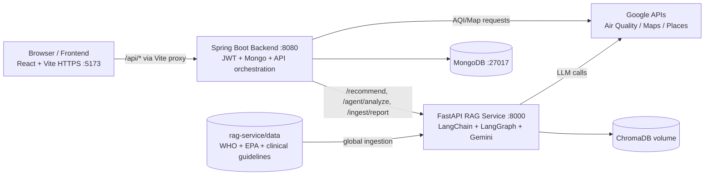

# BreatheSmart

Full-stack air-quality and health-intelligence platform. Live AQI on a map,
RAG-grounded health recommendations with source citations, and a LangGraph
agent that picks its own tools.

Three runtime services:

- `frontend` — React 19 + Vite (HTTPS dev)
- `backend` — Spring Boot 3.5 + MongoDB + JWT + Spring AI
- `rag-service` — FastAPI + LangChain + LangGraph + Gemini + ChromaDB

---

## Contents

1. [Architecture](#architecture)
2. [Quick start (Docker Compose)](#quick-start-docker-compose)
3. [Manual setup (no Docker)](#manual-setup-no-docker)
4. [Populating the RAG data folder](#populating-the-rag-data-folder)
5. [AI evaluation (RAGAS)](#ai-evaluation-ragas)
6. [Structured logging](#structured-logging)
7. [Resilience and security](#resilience-and-security)
8. [Project structure](#project-structure)
9. [Troubleshooting](#troubleshooting)

---

## Architecture



---

## Quick start (Docker Compose)

Mongo + rag-service + Spring backend run in containers. The frontend stays
local so HTTPS + hot reload work properly.

```bash
cp .env.example .env
# Fill GEMINI_API_KEY and JWT_SECRET (openssl rand -hex 64), optionally GOOGLE_MAPS_API_KEY.

docker compose up --build
# rag:      http://localhost:8000/health
# backend:  http://localhost:8080/actuator/health
# mongo:    mongodb://localhost:27017
```

Populate the corpus once the rag-service is up:

```bash
curl -X POST http://localhost:8000/ingest/global
```

Run the frontend:

```bash
cd frontend
npm install
echo "VITE_GOOGLE_MAPS_API_KEY=...your key..." > .env.local
npm run dev
# https://localhost:5173
```

---

## Manual setup (no Docker)

Need: Node 20+, Java 21, Python 3.12+, MongoDB on `:27017`.

```bash
# rag-service
cd rag-service
python -m venv venv && venv\Scripts\activate     # or: source venv/bin/activate
pip install -r requirements.txt
cp .env.example .env                              # set GEMINI_API_KEY
python main.py                                    # :8000

# backend (in a new shell)
cd backend
$env:GEMINI_API_KEY="..."; $env:JWT_SECRET="..."; $env:GOOGLE_MAPS_API_KEY="..."
./mvnw spring-boot:run                            # :8080

# frontend (in a new shell)
cd frontend
npm install
echo "VITE_GOOGLE_MAPS_API_KEY=..." > .env.local
npm run dev                                       # https://localhost:5173
```

---

## Populating the RAG data folder

Retrieval quality depends entirely on what's in `rag-service/data/`. The
loader (`app/ingestion/loader.py`) understands `.pdf`, `.txt`, `.md`,
`.html` / `.htm`. Anything else is skipped.

The repo ships a small seed corpus of curated `.md` files. For real
recommendations, drop authoritative PDFs into `rag-service/data/pdfs/`
(gitignored) and re-ingest.

Recommended sources:

| Source | What to grab | Why |
| --- | --- | --- |
| WHO Global Air Quality Guidelines 2021 | Executive summary PDF | PM2.5 / PM10 / NO₂ / O₃ thresholds |
| US EPA AQI Technical Assistance Document | PDF | Authoritative AQI breakpoints |
| EPA Particulate Matter Health Effects | PDF | Pulmonary + cardiovascular impacts |
| NHLBI Asthma Action Plan | PDF | Patient-facing severity tiers |
| GOLD COPD Pocket Guide | PDF | COPD personalization |
| AHA Air Pollution and Cardiovascular Disease | PDF/HTML | Cardiology guidance |
| ACOG / RCOG environmental health committee opinions | PDF | Pregnancy guidance |

Naming convention: `<source>_<topic>.pdf` — that filename is what shows up
under `sources[].source` in the `/recommend` response, so make it descriptive.

You can also auto-pull HTML pages:

```bash
cd rag-service
python scripts/download_docs.py
```

After adding files, re-ingest:

```bash
curl -X POST http://localhost:8000/ingest/global
# returns {loaded, chunks}
```

To wipe and re-index from scratch: stop rag-service, delete
`rag-service/chroma_db/` (or `docker volume rm breathesmart_chroma_data`),
then re-ingest.

---

## AI evaluation (RAGAS)

`rag-service/scripts/eval_ragas.py` runs the production pipeline against 10
medically diverse cases and scores it with RAGAS using the same Gemini LLM
and HuggingFace embeddings as production. Metrics: faithfulness, answer
relevancy, context precision.

```bash
cd rag-service
python scripts/eval_ragas.py                # real RAGAS
python scripts/eval_ragas.py --json out.json # machine-readable
python scripts/eval_ragas.py --no-ragas     # keyword-coverage fallback
```

Falls back to keyword coverage automatically if `ragas` isn't installed.

---

## Structured logging

The rag-service emits one JSON event per `/recommend` call on the
`rag.events` channel:

```json
{"ts":"...","level":"INFO","logger":"rag.events","event":"rag.recommend",
 "request_id":"a3f2b18c4d12","user_id":"...","query":"...","k":4,
 "retrieved":[{"source":"asthma_air_quality.md","scope":"global","score":0.82}],
 "min_score":0.82,"fallback_grounding":false,"llm_failed":false,
 "retrieve_latency_ms":41,"llm_latency_ms":1380,"total_latency_ms":1432}
```

`request_id` is returned to the caller and propagated through the Spring
DTO, so frontend → backend → rag-service correlation is one search away.
Set `LOG_FORMAT=text` for human-readable dev logs.

---

## Resilience and security

- LLM calls have timeout + retry; failures degrade to a deterministic safety
  recommendation (RAG) or a templated digest (Spring AI).
- LangGraph agent has a `recursion_limit` and a system-prompt tool-use policy.
- All Spring controllers pin CORS to dev origins (no `origins = "*"`).
- Auth interceptor wipes both `authToken` and `user` from localStorage on
  401/403.
- Public endpoints: `/api/auth/**`, `/api/map/**`, `/api/air-quality/**`.
  Authenticated: `/api/ai/**`, `/api/users/**`.

---

## Project structure

```text
BreatheSmart/
├── docker-compose.yml          # Mongo + rag-service + backend
├── .env.example
├── backend/
│   ├── Dockerfile
│   └── src/main/java/com/sreeshanth/backend/{config,controller,dto,model,service}
├── frontend/
│   └── src/{pages,components,services,styles}
└── rag-service/
    ├── Dockerfile              # Python 3.12, MiniLM pre-baked
    ├── main.py
    ├── app/
    │   ├── agent/              # graph.py, tools.py
    │   ├── ingestion/          # loader, splitter, embeddings, vectorstore
    │   ├── observability/      # JSON logging
    │   ├── rag/                # pipeline, retriever, llm, prompt
    │   └── routers/            # recommend, agent, ingest, health
    ├── data/                   # GLOBAL CORPUS — see populating section
    │   └── pdfs/               # gitignored; drop PDFs here
    └── scripts/
        ├── download_docs.py    # auto-fetch HTML
        └── eval_ragas.py       # RAGAS harness
```

---

## Troubleshooting

- **"Asks for login again right after I logged in"** — clear localStorage
  and reload; old corrupted sessions can have a `user` entry without a
  matching `authToken`.
- **Geolocation says permission denied** — Chrome's Permissions API state
  lags the real setting after re-grant. Refresh the page. Also confirm
  Windows Settings → Privacy & security → Location is on for the browser.
- **Generic / empty recommendations** — check `min_score` in the
  `rag.events` JSON log. If high (poor match), expand the corpus.
- **Compose `MONGODB_URI must be set`** — ensure `.env` exists at repo root
  with `GEMINI_API_KEY` and `JWT_SECRET`.
