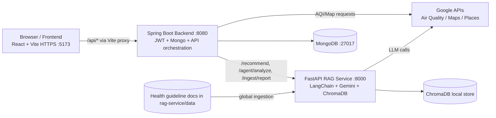

# BreatheSmart

BreatheSmart is a full-stack air quality and health intelligence platform.
It combines:

- Real-time AQI and forecast data on an interactive map
- User profile and authentication
- Saved locations and report uploads
- RAG-grounded personalized health recommendations
- Agentic analysis flow (LangGraph tools)

This repository is a monorepo with three runtime services:

- `frontend` (React + Vite, HTTPS dev server)
- `backend` (Spring Boot + MongoDB + JWT + Spring AI)
- `rag-service` (FastAPI + LangChain + Gemini + ChromaDB)

---

## Table of contents

1. [System architecture](#system-architecture)
2. [How data flows](#how-data-flows)
3. [Tech stack](#tech-stack)
4. [Prerequisites](#prerequisites)
5. [Environment variables and secrets](#environment-variables-and-secrets)
6. [Google APIs and required setup](#google-apis-and-required-setup)
7. [HTTPS certificates and geolocation requirements](#https-certificates-and-geolocation-requirements)
8. [Step-by-step local setup](#step-by-step-local-setup)
9. [API reference](#api-reference)
10. [RAG service internals](#rag-service-internals)
11. [Security model](#security-model)
12. [Troubleshooting](#troubleshooting)
13. [Project structure](#project-structure)

---

## System architecture



### Service responsibilities

#### Frontend
- Handles UI/UX, map visualization, auth modals, profile modals, charts, and report upload interaction.
- Uses `/api` proxy to backend from Vite.
- Runs with HTTPS in dev (`vite.config.js` uses `@vitejs/plugin-basic-ssl`) for geolocation compatibility.

#### Backend
- Owns auth, user profile, saved locations, reports list, and protected APIs.
- Calls Google Air Quality API for current/history/forecast.
- Calls FastAPI RAG service for recommendation, agentic analysis, and report ingestion.
- Stores users and metadata in MongoDB.

#### RAG service
- Ingests global health guideline documents into ChromaDB.
- Ingests user-specific report text into scoped vector chunks.
- Retrieves context and generates structured recommendations with source snippets.
- Provides an agent route that chains AQI tool + recommendation tool.

---

## How data flows

### 1) AQI dashboard flow
1. Frontend calls backend `/api/air-quality/current`, `/history`, `/forecast`.
2. Backend calls Google Air Quality API.
3. Backend returns normalized payload to frontend.
4. Frontend renders gauge, pollutants, history, and forecast charts.

### 2) RAG recommendation flow
1. User logs in and requests AI recommendations.
2. Frontend calls backend `/api/ai/recommendations` with current AQI context.
3. Backend builds profile + AQI payload and calls RAG `/recommend`.
4. RAG retrieves from:
	- Global corpus (`scope=global`)
	- User corpus (`scope=user_<userId>`, if available)
5. Gemini returns structured JSON recommendation.
6. Frontend displays recommendation and source snippets.

### 3) Report upload flow
1. Frontend uploads file to backend `/api/users/{userId}/reports`.
2. Backend stores file and extracts text using Apache Tika.
3. Backend calls RAG `/ingest/report` to chunk/index the report text.
4. RAG validates medical relevance before ingestion.
5. Backend appends report metadata to user document in MongoDB.

---

## Tech stack

### Frontend
- React 19
- Vite 7
- Material UI + icons
- Chart.js + react-chartjs-2
- Axios

### Backend
- Java 21
- Spring Boot 3.5.6
- Spring Security + JWT (`jjwt`)
- Spring Data MongoDB
- Spring AI (Gemini via OpenAI-compatible endpoint)
- Apache Tika (document text extraction)

### RAG service
- FastAPI + Uvicorn
- LangChain + LangGraph
- Gemini (`langchain-google-genai`)
- ChromaDB vector store
- HuggingFace embeddings (`all-MiniLM-L6-v2`)

---

## Prerequisites

- Node.js 20+ and npm
- Java 21
- Maven 3.9+ (or use backend wrapper)
- Python 3.11 recommended
- MongoDB running locally on port `27017`
- Google Cloud API key with required APIs enabled

---

## Environment variables and secrets

Do **not** hardcode keys. This repo is now configured for environment-driven secrets.

### Backend required variables

Configured in `backend/src/main/resources/application.properties`:

- `GOOGLE_MAPS_API_KEY`
- `GEMINI_API_KEY`
- `JWT_SECRET`

Optional defaulted values:

- `spring.data.mongodb.uri` defaults to `mongodb://localhost:27017/breathesmart`
- `rag.service.base-url` defaults to `http://localhost:8000`

### Frontend required variables

Create `frontend/.env.local`:

```env
VITE_GOOGLE_MAPS_API_KEY=your-google-key
```

Frontend reads this via:

- `frontend/src/services/airQualityService.js`

### RAG service required variables

Copy template and fill values:

```bash
cp rag-service/.env.example rag-service/.env
```

Important keys in `rag-service/.env`:

- `GEMINI_API_KEY`
- `GEMINI_MODEL` (default in template: `gemini-2.5-pro`)
- `CHROMA_DB_PATH`
- `CHROMA_COLLECTION_NAME`
- `EMBEDDING_MODEL`

---

## Google APIs and required setup

Create one Google Cloud API key and enable at least:

1. Air Quality API
2. Maps JavaScript API
3. Places API
4. Geocoding API

### Recommended API key restrictions

1. **Application restrictions**
	- For frontend browser usage: HTTP referrers
	- Allow local dev origins such as:
	  - `https://localhost:5173/*`
	  - `http://localhost:5173/*` (if needed)

2. **API restrictions**
	- Restrict key to only required APIs listed above.

3. **Rotation**
	- Rotate keys periodically.
	- Immediately rotate if exposed in Git history.

---

## HTTPS certificates and geolocation requirements

Geolocation APIs in modern browsers require a **secure context**:

- `https://...` OR
- `http://localhost` (localhost exception)

This project uses HTTPS in local dev:

- `frontend/vite.config.js` has:
  - `basicSsl()` plugin
  - `server.https = true`

### What certificate is used in dev?

`@vitejs/plugin-basic-ssl` generates a local self-signed certificate for local development.

### For production

Use a trusted TLS certificate from:

- Let's Encrypt
- Cloudflare
- AWS ACM
- Your enterprise PKI

Terminate TLS at reverse proxy/load balancer (Nginx/Traefik/Ingress) and serve app over HTTPS.

### Browser + OS permission requirements for location

Even with HTTPS, location can fail if blocked at OS/browser level.

Checklist:

1. Browser site settings: Location = Allow
2. Windows settings:
	- Settings -> Privacy & security -> Location
	- Enable Location services
	- Allow app/browser location access
3. Use exact allowed origin (`https://localhost:5173`)

---

## Step-by-step local setup

Run all services from project root unless noted.

### 1) Start MongoDB

Ensure MongoDB is listening on:

- `mongodb://localhost:27017`

### 2) Setup and run RAG service

```bash
cd rag-service
python -m venv venv
# Windows
venv\Scripts\activate
# macOS/Linux
# source venv/bin/activate

pip install -r requirements.txt

# configure env
copy .env.example .env   # Windows
# cp .env.example .env   # macOS/Linux
```

Edit `.env` and set `GEMINI_API_KEY`.

Start service:

```bash
python main.py
```

RAG runs on:

- `http://localhost:8000`

Verify health:

```bash
curl http://localhost:8000/health
```

### 3) Ingest global corpus (one-time or when docs change)

With RAG running:

```bash
curl -X POST http://localhost:8000/ingest/global
```

This loads documents from `rag-service/data` into ChromaDB.

### 4) Setup and run backend

```bash
cd backend
```

Set environment variables in your shell:

```powershell
$env:GOOGLE_MAPS_API_KEY="your-google-key"
$env:GEMINI_API_KEY="your-gemini-key"
$env:JWT_SECRET="your-long-random-secret-at-least-32-bytes"
```

Run backend:

```bash
./mvnw spring-boot:run
```

Backend runs on:

- `http://localhost:8080`

### 5) Setup and run frontend

```bash
cd frontend
npm install
```

Create `frontend/.env.local`:

```env
VITE_GOOGLE_MAPS_API_KEY=your-google-key
```

Start frontend:

```bash
npm run dev
```

Frontend runs on:

- `https://localhost:5173`

---

## API reference

### Backend APIs

#### Auth (`/api/auth`)
- `POST /signup`
- `POST /login`

#### Air quality (`/api/air-quality`)
- `POST /current`
- `POST /history`
- `POST /forecast`
- `POST /preferred-aqi`

#### AI (`/api/ai`) - authenticated
- `POST /recommendations` (RAG)
- `POST /agent` (LangGraph agent)
- `POST /summary` (Spring AI direct summary)

#### Users (`/api/users`) - authenticated
- `PUT /{id}`
- `POST /{id}/saved-locations`
- `GET /{id}/saved-locations`
- `PUT /{id}/saved-locations/{locationName}`
- `DELETE /{id}/saved-locations/{locationName}`
- `POST /{userId}/reports` (multipart upload)
- `GET /{userId}/reports`

#### Map config (`/api/map`)
- `GET /config`
- `POST /geocode/reverse`
- `GET /heatmap-tiles`

### RAG APIs

- `GET /health`
- `POST /recommend`
- `POST /agent/analyze`
- `POST /ingest/global`
- `POST /ingest/report`

---

## RAG service internals

### Retrieval design

- Vector DB: ChromaDB local persistent store
- Embeddings: `sentence-transformers/all-MiniLM-L6-v2`
- Prompt pipeline builds contextual recommendation request from:
  - User profile
  - AQI context
  - Retrieved chunks

### Data scopes

1. `global` scope
	- Ingested from shared medical/environmental docs
2. `user_<user_id>` scope
	- Ingested from uploaded report text

Recommendation retrieval can combine both scopes to personalize guidance.

### Ingestion specifics

- Global ingestion batches vectors in chunks of 5000 to avoid Chroma batch-size errors.
- Report ingestion performs medical-content relevance validation before indexing.

---

## Security model

Configured in backend security chain:

- Public:
  - `/api/auth/**`
  - `/api/map/**`
  - `/api/air-quality/**`
- Auth required:
  - `/api/ai/**`
  - `/api/users/**`

Frontend stores JWT in local storage and sends it as Bearer token through Axios interceptor.

---

## Troubleshooting

### Geolocation says permission denied

1. Open app on `https://localhost:5173`
2. Allow site location permission in browser
3. Enable Windows Location services
4. Confirm browser/app-level location access is allowed
5. Hard refresh after permission changes

### RAG recommendations failing

1. Check RAG health endpoint
2. Ensure `GEMINI_API_KEY` is set in `rag-service/.env`
3. Confirm backend can reach `rag.service.base-url`
4. Verify global docs were ingested (`/ingest/global`)

### Report upload rejected as non-medical

- This is expected if uploaded content does not appear to be health/clinical text.
- Upload actual medical report documents for personalization.

### Empty or poor recommendations

1. Re-run global ingestion
2. Ensure report ingestion succeeded
3. Verify user profile fields (age/conditions) are present

### API key errors

1. Confirm key is valid and active
2. Confirm required APIs are enabled
3. Confirm referrer restrictions include your frontend origin

---

## Project structure

```text
BreatheSmart/
  backend/        # Spring Boot API + auth + orchestration
  frontend/       # React app + map + charts + UI flows
  rag-service/    # FastAPI + RAG + ingestion + LangGraph agent
  uploads/        # Stored uploaded report files
```

---

## Notes for deployment

- Use HTTPS everywhere in production.
- Keep secrets in a secure secret manager (not in repo).
- Restrict Google API keys by referrer/API.
- Rotate any previously exposed keys and clean Git history if needed.
