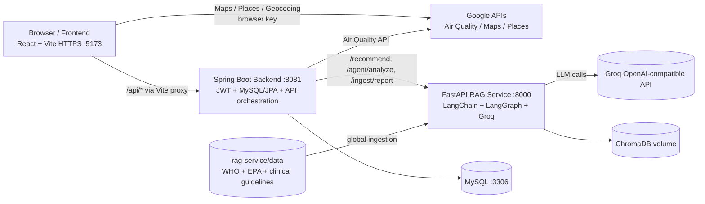

# BreatheSmart

Full-stack air-quality and health-intelligence platform. Live AQI on an
interactive map, RAG-grounded health recommendations with source citations,
and a LangGraph agent that picks its own tools — wrapped in a modular,
mobile-first React UI with light/dark themes.

Three runtime services:

| Service | Stack | Port | Role |
|---|---|---|---|
| `frontend` | React 19 + Vite (HTTPS dev) | 5173 | UI — map, AQI dashboards, recommendations, agent panel, settings |
| `backend` | Spring Boot 3.5 + MySQL (Spring Data JPA) + JWT (BCrypt) + Spring AI | 8081 | Auth, persistence, Google API orchestration, AI proxy |
| `rag-service` | FastAPI + LangChain + LangGraph + **Groq** (OpenAI-compatible) + ChromaDB | 8000 | All RAG / agent / LLM-retrieval logic |

The LLM is **Groq** via its OpenAI-compatible Chat Completions API
(default model `openai/gpt-oss-20b`). Both LLM call sites — the rag-service
(`langchain-openai`) and the backend (Spring AI OpenAI starter) — point at
`https://api.groq.com/openai/v1`, so switching providers is a base-url +
model + key change with no code edits.

---

## Contents

1. [Architecture](#architecture)
2. [API keys & secrets](#api-keys--secrets)
3. [Quick start (Docker Compose)](#quick-start-docker-compose)
4. [Manual setup (no Docker)](#manual-setup-no-docker)
5. [Frontend](#frontend)
6. [Populating the RAG data folder](#populating-the-rag-data-folder)
7. [AI evaluation (RAGAS)](#ai-evaluation-ragas)
8. [Structured logging](#structured-logging)
9. [Resilience and security](#resilience-and-security)
10. [Project structure](#project-structure)
11. [Troubleshooting](#troubleshooting)

---

## Architecture



**The Spring ↔ Python split is the central design decision.** The backend is
a thin orchestrator — it owns the `User`, auth, and Google API calls, and
delegates everything retrieval/agent-related to the Python service over HTTP
(`RagServiceClient` is the single seam). The frontend never calls the
rag-service directly; all AI goes browser → backend `/api/ai/*` → rag-service.

---

## API keys & secrets

API keys are **placeholders** in the git-tracked config — no real keys are
committed, and there are no `.env` files with secrets. To run for real,
either replace the placeholder strings in place, or set the matching env var
(env **overrides** the placeholder):

| Key | Placeholder lives in | Env override |
|---|---|---|
| Groq LLM key | `backend/.../application.properties`, `rag-service/app/config.py` | `GROQ_API_KEY` |
| Google Maps key | `application.properties`, `config.py`, `frontend/.../airQualityService.js` | `GOOGLE_MAPS_API_KEY` (server), `VITE_GOOGLE_MAPS_API_KEY` (browser) |
| JWT secret | — (no default) | `JWT_SECRET` (required; `openssl rand -hex 64`) |

> The Maps browser key is exposed to the client by design — restrict it by
> HTTP referrer in the Google Cloud console. Rotate both keys before any
> public deployment.

---

## Quick start (Docker Compose)

MySQL + rag-service + Spring backend run in containers. The frontend stays
local so HTTPS + hot reload work properly. Hibernate (`ddl-auto=update`)
auto-creates the schema on first boot, so there's no manual DB setup.

```bash
# Provide secrets via the shell (Compose reads them) — env overrides the
# committed placeholders. JWT_SECRET is required.
export JWT_SECRET="$(openssl rand -hex 64)"
export GROQ_API_KEY="gsk_..."           # optional if you edited config in place
export GOOGLE_MAPS_API_KEY="AIza..."     # optional if you edited config in place

docker compose up --build
# rag:      http://localhost:8000/health
# backend:  http://localhost:8081/actuator/health
# mysql:    localhost:3306  (db breathesmart, root/root)
```

Populate the corpus once the rag-service is up (required, or retrieval
returns nothing):

```bash
curl -X POST http://localhost:8000/ingest/global
```

Run the frontend:

```bash
cd frontend
npm install
echo "VITE_GOOGLE_MAPS_API_KEY=...your key..." > .env.local   # optional; overrides the placeholder fallback
npm run dev
# https://localhost:5173
```

---

## Manual setup (no Docker)

Need: Node 20+, Java 21, Python 3.12+, MySQL 8 on `:3306` (creds `root`/`root`).
The backend connects to `jdbc:mysql://localhost:3306/breathesmart?...` and
Hibernate (`ddl-auto=update`) auto-creates the schema — you only need a running
MySQL; the `breathesmart` database is auto-created via the `createDatabaseIfNotExist`
URL flag.

```bash
# rag-service
cd rag-service
python -m venv venv && venv\Scripts\activate     # or: source venv/bin/activate
pip install -r requirements.txt
$env:GROQ_API_KEY="gsk_..."                       # or edit app/config.py
python main.py                                    # :8000

# backend (in a new shell) — defaults to local MySQL root/root; override with
# SPRING_DATASOURCE_URL / SPRING_DATASOURCE_USERNAME / SPRING_DATASOURCE_PASSWORD if needed
cd backend
$env:GROQ_API_KEY="gsk_..."; $env:JWT_SECRET="..."; $env:GOOGLE_MAPS_API_KEY="AIza..."
./mvnw spring-boot:run                            # :8081  (.\mvnw.cmd on Windows)

# frontend (in a new shell)
cd frontend
npm install
echo "VITE_GOOGLE_MAPS_API_KEY=..." > .env.local
npm run dev                                       # https://localhost:5173
```

---

## Frontend

React 19 + Vite, organised for reuse: `hooks/` (auth, theme, settings,
places autocomplete), `components/`, `services/` (backend wrappers + direct
Google calls), `utils/`, and a token-driven `styles/` layer.

- **Design system** — one set of design tokens in `App.css` (`--color-*`,
  `--space-*`, `--radius-*`, shadows) plus shared brand fonts loaded in
  `index.css`: **Hanken Grotesk** (UI), **JetBrains Mono** (data/labels),
  **Fraunces** (the landing's editorial display face). Components reference
  tokens, so the whole app re-themes from one place.
- **Light & dark themes** — `theme.css` flips the tokens and key surfaces to a
  true-black dark theme via `html[data-theme="dark"]`; the map restyles too.
- **Settings** — theme, a 5-step font-size scale (XS–XL), and reduce-motion,
  applied to `<html>` at first paint and persisted in `localStorage`.
- **Mobile-first & responsive** — on phones the map is full-screen, the panel
  becomes a sheet, and a floating **bottom navigation bar** + compact brand +
  floating search replace the desktop chrome. Modals share one responsive
  shell, so every dialog has consistent width/gutters on any screen.
- **Two routes** — `/` (landing) and `/app` (the single-page map experience).
  `/app` is not route-guarded; auth gating is per-feature.

```bash
cd frontend
npm run dev       # https://localhost:5173 (self-signed)
npm run build     # production build
npm run lint      # ESLint (the only frontend check)
```

---

## Populating the RAG data folder

Retrieval quality depends entirely on what's in `rag-service/data/`. The
loader (`app/ingestion/loader.py`) understands `.pdf`, `.txt`, `.md`,
`.html` / `.htm`. Anything else is skipped.

The repo ships a curated seed corpus of `.md` files (WHO/EPA AQI guidance plus
condition-specific notes — asthma, COPD, pregnancy, diabetes, cardiovascular).
For richer recommendations, drop authoritative PDFs into
`rag-service/data/pdfs/` (gitignored) and re-ingest.

Recommended sources:

| Source | What to grab | Why |
| --- | --- | --- |
| WHO Global Air Quality Guidelines 2021 | Executive summary PDF | PM2.5 / PM10 / NO₂ / O₃ thresholds |
| US EPA AQI Technical Assistance Document | PDF | Authoritative AQI breakpoints |
| EPA Particulate Matter Health Effects | PDF | Pulmonary + cardiovascular impacts |
| NHLBI Asthma Action Plan | PDF | Patient-facing severity tiers |
| GOLD COPD Pocket Guide | PDF | COPD personalization |
| AHA Air Pollution and Cardiovascular Disease | PDF/HTML | Cardiology guidance |

Naming convention: `<source>_<topic>.pdf` — that filename is what shows up
under `sources[].source` in the `/recommend` response, so make it descriptive.

You can also auto-pull the HTML reference pages:

```bash
cd rag-service
python scripts/download_docs.py
```

After adding files, re-ingest:

```bash
curl -X POST http://localhost:8000/ingest/global    # returns {loaded, chunks}
```

To wipe and re-index from scratch: stop rag-service, delete
`rag-service/chroma_db/` (or `docker volume rm breathesmart_chroma_data`),
then re-ingest. Ingestion is idempotent (stable chunk IDs), so re-running on an
unchanged corpus won't duplicate.

---

## AI evaluation (RAGAS)

`rag-service/scripts/eval_ragas.py` runs the production pipeline against 10
medically diverse cases and scores it with RAGAS using the same **Groq** LLM
and HuggingFace embeddings as production. Metrics: faithfulness, answer
relevancy, context precision.

```bash
cd rag-service
python scripts/eval_ragas.py                 # real RAGAS
python scripts/eval_ragas.py --json out.json # machine-readable
python scripts/eval_ragas.py --no-ragas      # keyword-coverage fallback
```

Falls back to keyword coverage automatically if `ragas` isn't installed.

---

## Structured logging

The rag-service emits one JSON event per `/recommend` call on the
`rag.events` channel:

```json
{"ts":"...","level":"INFO","logger":"rag.events","event":"rag.recommend",
 "request_id":"a3f2b18c4d12","user_id":"...","query":"...","k":4,
 "retrieved":[{"source":"asthma_air_quality.md","scope":"global","score":0.82}],
 "min_score":0.82,"fallback_grounding":false,"llm_failed":false,
 "retrieve_latency_ms":41,"llm_latency_ms":1380,"total_latency_ms":1432}
```

`request_id` is returned to the caller and propagated through the Spring DTO,
so frontend → backend → rag-service correlation is one search away. Set
`LOG_FORMAT=text` for human-readable dev logs. When recommendations look
generic, check `min_score` — high distance means a poor corpus match, not a
code bug (Chroma uses L2 distance; lower = more similar).

---

## Resilience and security

- LLM calls have timeout + retry; failures degrade to a deterministic safety
  recommendation (RAG) or a templated digest (Spring AI).
- LangGraph agent has a `recursion_limit` and a system-prompt tool-use policy.
- Passwords are hashed with **BCrypt**; sessions are stateless **JWT**.
- All Spring controllers pin CORS to dev origins (no `origins = "*"`).
- Auth interceptor wipes both `authToken` and `user` from localStorage on
  401/403.
- Per-user retrieval scoping: every Chroma chunk carries a `scope`
  (`global` or `user_<id>`); a user only ever retrieves global guidelines +
  their own uploaded reports.
- Public endpoints: `/api/auth/**`, `/api/map/**`, `/api/air-quality/**`.
  Authenticated: `/api/ai/**`, `/api/users/**`.

---

## Project structure

```text
BreatheSmart/
├── docker-compose.yml          # MySQL + rag-service + backend
├── backend/
│   ├── Dockerfile
│   └── src/main/java/com/sreeshanth/backend/{config,controller,dto,model,service}
├── frontend/
│   └── src/{pages,components,hooks,services,styles,utils}
└── rag-service/
    ├── Dockerfile              # Python 3.12, MiniLM embeddings pre-baked
    ├── main.py
    ├── app/
    │   ├── agent/              # graph.py, tools.py
    │   ├── ingestion/          # loader, splitter, embeddings, vectorstore
    │   ├── observability/      # JSON logging
    │   ├── rag/                # pipeline, retriever, llm, prompt
    │   └── routers/            # recommend, agent, ingest, health
    ├── data/                   # GLOBAL CORPUS — see populating section
    │   └── pdfs/               # gitignored; drop PDFs here
    └── scripts/
        ├── download_docs.py    # auto-fetch HTML references
        └── eval_ragas.py       # RAGAS harness
```

---

## Troubleshooting

- **Backend won't start / "Communications link failure" / "Access denied"** —
  MySQL isn't reachable or the creds don't match. Confirm MySQL 8 is running on
  `:3306` with user `root`/`root`, or point the app elsewhere via
  `SPRING_DATASOURCE_URL` / `SPRING_DATASOURCE_USERNAME` / `SPRING_DATASOURCE_PASSWORD`.
  The `breathesmart` database is auto-created by the `createDatabaseIfNotExist`
  URL flag and tables are auto-created by Hibernate (`ddl-auto=update`) — no manual
  schema setup needed.
- **"Asks for login again right after I logged in"** — clear localStorage and
  reload; an old session can have a `user` entry without a matching
  `authToken`.
- **"API key not valid" / map won't load** — the committed Maps key is a
  placeholder. Set `VITE_GOOGLE_MAPS_API_KEY` (frontend) and
  `GOOGLE_MAPS_API_KEY` (backend), and enable the Maps JS, Places, Geocoding,
  and Air Quality APIs on the key.
- **Geolocation says permission denied** — Chrome's Permissions API state lags
  the real setting after re-grant. Refresh the page. Also confirm Windows
  Settings → Privacy & security → Location is on for the browser.
- **Generic / empty recommendations** — check `min_score` in the `rag.events`
  JSON log. If high (poor match), expand the corpus, then re-`/ingest/global`.
- **LLM errors from the rag-service or backend** — confirm `GROQ_API_KEY` is
  set (or the placeholder replaced) and the model `openai/gpt-oss-20b` is
  available on your Groq account.
```
